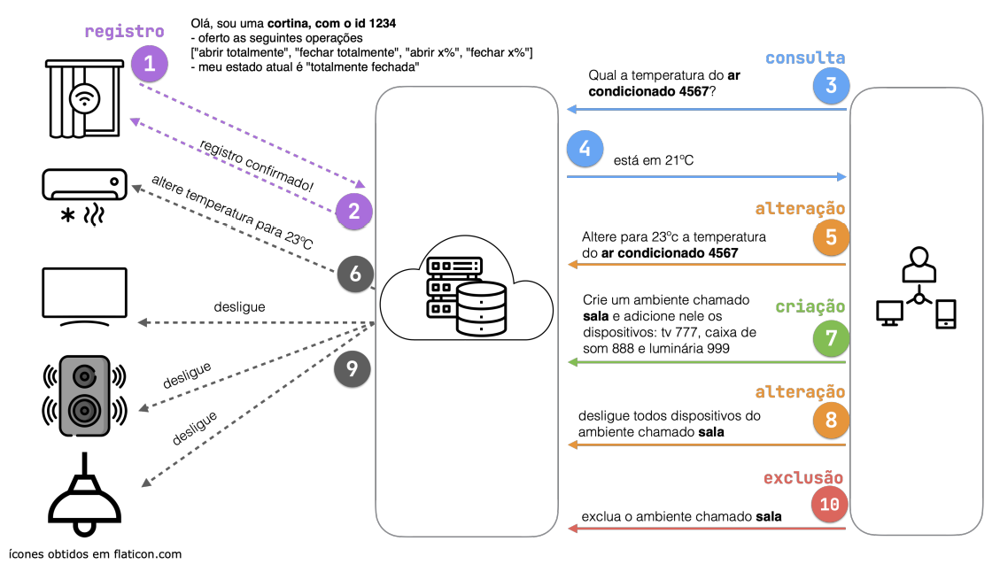

# Projeto 1 - Automação residencial com dispositivos inteligentes

Fazendo o uso apenas das tecnologias apresentadas nos laboratórios 1, 4 e 5 da disciplina de Sistemas Distribuídos, desenvolva em software uma solução de automação residencial com dispositivos inteligentes, na figura 1 é apresentado o cenário da solução desejada o qual é composto por: dispositivos inteligentes (e.g. cortina, TV, lâmpada, etc.); servidor hospedado na nuvem; clientes (e.g. aplicativo para dispositivos móveis, computadores).



Na figura 1 são ilustradas algumas trocas de mensagens entre os componentes. Sempre que o usuário compra um novo dispositivo inteligente, esse deve iniciar o processo de registro do mesmo (veja o passo 1). O novo dispositivo deve então enviar uma mensagem para o servidor na nuvem (ele já conhece os dados necessários para interagir com o servidor) indicando que tipo de dispositivo ele é (e.g. cortina), qual é o seu identificador único (é necessário garantir isso) e quais são as operações que ele é capaz de realizar. Por exemplo, uma cortina pode ser aberta ou fechada, uma TV pode ser ligada ou desligada, etc.

Assumindo que o usuário já tenha registrado todos os dispositivos, esse poderá enviar comandos para cada dispositivo, sendo que a comunicação sempre será intermediada pelo servidor. Por exemplo, o usuário deseja saber qual é a temperatura que está configurada atualmente no ar condicionado `4567` (passos 3 e 4). O usuário poderá também alterar a temperatura do ar condicionado (passo 5), comando o qual é propagado pelo servidor na nuvem para o dispositivo (passo 6).

A solução deve permitir ao usuário agrupar dispositivos por ambiente, pois isso facilitaria a interação do usuário com todos os dispositivos de um ambiente. Por exemplo, no passo 7 o usuário cria um ambiente reunindo a TV, caixa de som e luminária. No passo 8 o usuário envia o comando para desligar todos os dispositivos do ambiente sala (o servidor propaga esse comando para todos os dispositivos no passo 9). Por fim, o usuário poderá também excluir um ambiente (passo 10) ou mesmo remover um dispositivo que já esteja alocado num ambiente.

**Atenção:** a mensagem de registro (passo 1 da figura 1) é a única mensagem que o dispositivo precisa enviar para o servidor na nuvem. Todas as outras mensagens são enviadas pelo cliente para o servidor na nuvem e esse é quem propaga para os dispositivos, os quais não precisam (mas se achar necessário, podem) enviar qualquer tipo de resposta ao servidor na nuvem.

## Cronograma de entregas

> [!WARNING] Atenção
> - Todas as entregas deverão ser feitas até as 07:00 do dia indicado nesse documento.
> - Entregas tardias terão conceito máximo 5. com exceção da última entrega, uma entrega tardia poderá ser feita no máximo em até 5 dias após o prazo original.
> - Uma não entrega implica em conceito 0 na entrega atual e em todas as entregas subsequentes. Nesse caso, o(a) aluno(a) cairá automaticamente na recupreção, devendo entregar o projeto completo em até 5 dias após a data prevista para a última entrega ou em até um dia antes de finalizar o semestre (o que ocorrer primeiro).

Todas as entregas deverão ser feitas obrigatoriamente no ramo main do repositório no GitHub. Crie um diretório na raiz do repositório no GitHub para colocar os artefatos que gerará para cada uma das entregas abaixo. Por exemplo:

```
├── README.md
├── entrega-1
│   └── README.md
├── entrega-2
│   └── api.yaml
├── entrega-3
└── entrega-4
```

### **Entrega 1** 27/11/2023 (peso 1)

- Documento detalhando as tecnologias que escolheu para o desenvolvimento de cada componente que compõe o sistema de automação residencial. Por exemplo, qual tecnologia escolheu para desenvolver o servidor na nuvem, qual tecnologia escolheu para desenvolver o cliente, qual tecnologia escolheu para desenvolver o dispositivo inteligente, etc.
  - Dependendo das escolhas que fizer, talvez não seja necessário desenvolver um cliente.
- É importante ressaltar como será a comunicação entre cada componente (e.g. como será feita a localização, troca de mensagens, protocolo de comunicação, etc.).
  
### **Entrega 2** 04/12/2023 (peso 2)

- Entrega da(s) API(s) RESTful documentada(s) com [OpenAPI]. Apenas arquivo(s) `YAML`.

### **Entrega 3** 06/12/2023 (peso 1)

- Entrega do código (e.g. Dockerfile, docker-compose.yml) para subir uma composição de contêineres docker com todos os componentes do sistema de automação residencial.
- Entrega de documentação indicando como subir a composição de contêineres docker.

### **Entrega 4** 16/12/2023 (peso 6)

- Entrega do código-fonte do sistema de automação residencial completo e pronto para ser executado dentro de contêineres docker.
- Entrega de documentação indicando como compilar e executar um cenário composto por 5 dispositivos (cada um obrigatoriamente em um contêiner docker diferente), sendo que cada um deve ser de um tipo diferente (i.e. TV, lâmpada, cortina, ar condicionado, etc.).
- É necessário apresentar instruções para um cliente se conectar ao servidor e interagir com os dispositivos inteligentes. Por exemplo, como um cliente poderia ligar a TV, desligar a lâmpada, criar um ambiente, etc. É necessário apresentar instruções para interagir com todos os recursos da API.
- Indicar quais funcionalidades foram implementadas e quais não foram.
- **Atenção:** Clone o seu projeto em outro diretório e siga as instruções que você mesmo escreveu para compilar e executar o projeto. Se não for possível compilar e executar o projeto, então a nota será 0 nesse item.

> [!CAUTION] Plágio não é tolerado
> Você deve ser o único(a) responsável por fazer a entrega para essa atividade. Todo o código ou texto deverá ser produzido exclusivamente por você, exceto trechos de códigos que possam ter sido fornecidos como parte do enunciado.
>
> Você pode discutir com outros estudantes com o intuito de esclarecer pontos, isso é até incentivado, porém não poderá copiar trechos de códigos, textos ou soluções de qualquer fonte (i.e. colegas da mesma turma ou de turmas anteriores, repositórios de códigos na internet ou soluções providas por serviçõs como Copilot e ChatGPT)

[OpenAPI]: https://www.openapis.org/